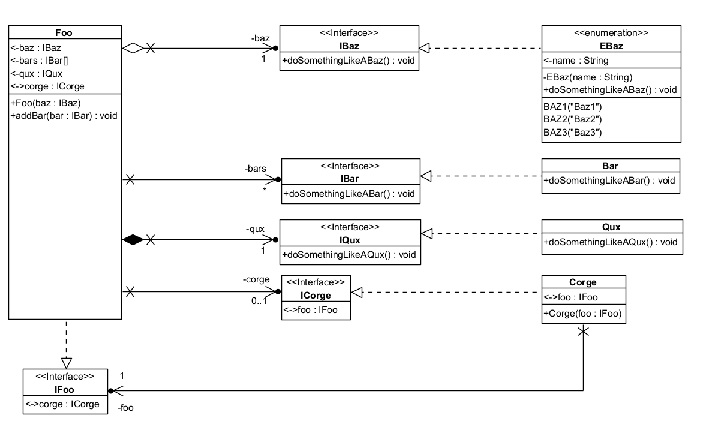

# Foo-Bar-Baz-Qux-Corge-Interface-Enum

# Interface - Enumération

# Made with ❤️ by [JAD](mailto:jeanaymeric@gmail.com)

## Objectif :

Implémenter en Java le diagramme de classes suivant :
Toutes vos classes doivent être dans le package `com.jad`.



## Validation

Des tests unitaires sont fournis pour valider votre implémentation.

À chaque commit and push, les tests sont exécutés automatiquement par GitHub Actions.

Pour visualiser les résultats des tests, cliquez sur l'onglet `Actions` de votre dépôt GitHub.

Pour le moment, aucun élément n'est implémenté, donc les tests échouent.

Pour les méthodes `doSomethingLikeA` des éléments `Bar`, `EBaz` et `Qux`, inutile de coder quoi que ce soit.
Exemple pour `doSomethingLikeABar` :

```java
public void doSomethingLikeABar() {
    // Do nothing
}
```
